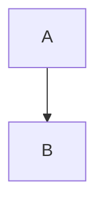



## Welcome to GitHub Pages

You can use the [editor on GitHub](https://github.com/yjmantilla/yjmantilla.github.io/edit/master/README.md) to maintain and preview the content for your website in Markdown files.

Whenever you commit to this repository, GitHub Pages will run [Jekyll](https://jekyllrb.com/) to rebuild the pages in your site, from the content in your Markdown files.

### Markdown

Markdown is a lightweight and easy-to-use syntax for styling your writing. It includes conventions for

```markdown
Syntax highlighted code block

# Header 1
## Header 2
### Header 3

- Bulleted
- List

1. Numbered
2. List

**Bold** and _Italic_ and `Code` text

[Link](url) and 
```

For more details see [GitHub Flavored Markdown](https://guides.github.com/features/mastering-markdown/).

### Jekyll Themes

Your Pages site will use the layout and styles from the Jekyll theme you have selected in your [repository settings](https://github.com/yjmantilla/yjmantilla.github.io/settings). The name of this theme is saved in the Jekyll `_config.yml` configuration file.

### Support or Contact

Having trouble with Pages? Check out our [documentation](https://help.github.com/categories/github-pages-basics/) or [contact support](https://github.com/contact) and we’ll help you sort it out.

### Mermaid



<pre><code class="language-mermaid">graph LR
A--&gt;B
</code></pre>

<div class="mermaid">graph LR
A--&gt;B
</div>

<div class="mermaid">graph LR
    graph TD
    A[Client] --> B[Load Balancer]
    B --> C[Server1]
    B --> D[Server2]
</div>

<body>

    Here is one mermaid diagram:
    <div class="mermaid">
      graph TD
      A[Client] --> B[Load Balancer]
      B --> C[Server1]
      B --> D[Server2]
    </div>

    This doesnt work...
    
    And here is another:
    <div class="mermaid">
      graph TD
      A[Client] -->|tcp_123| B(Load Balancer)
      B -->|tcp_456| C[Server1]
      B -->|tcp_456| D[Server2]
    </div>
</body>

### Math
you can use an inline formula $$\forall x \in R$$ like this one

$$
M = \left( \begin{array}{ccc}
x_{11} & x_{12} & \ldots \\
x_{21} & x_{22} & \ldots \\
\vdots & \vdots & \ldots \\
\end{array} \right)
$$

