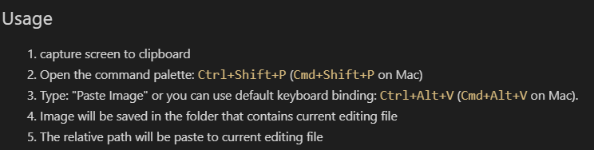

# Foam

Se pueden hacer referencias de hypertexto al estilo [wiki](https://foambubble.github.io/foam/wiki-links)

>The Foam for VSCode extension automatically generates Link Reference Definitions at >the bottom of the file to make wiki-links compatible with Markdown tools and parsers.

You can make a network of thoughts chunks or ideas with the help of <https://github.com/vasturiano/force-graph>

Idealmente los chunks deberían tener nombre único y siguiendo el [kebab case](https://www.theserverside.com/blog/Coffee-Talk-Java-News-Stories-and-Opinions/Why-you-should-make-kebab-case-a-URL-naming-convention-best-practice)

Podrían usarse [tags](https://foambubble.github.io/foam/features/tags). Esto podría aprovecharse para organizar poemas con base en tematicas?. O quizás la idea de categorías de jekyll.

Para empezar ver el [menú de recetas](https://foambubble.github.io/foam/recipes/recipes)

Se pueden incluir facilmente imagenes con [esto](https://foambubble.github.io/foam/recipes/add-images-to-notes)

