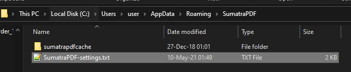
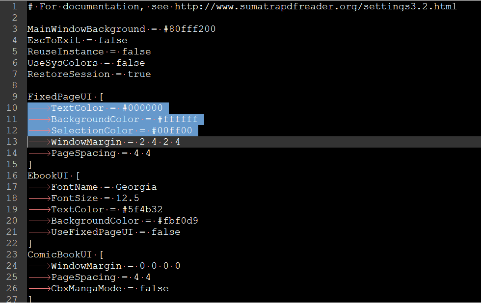
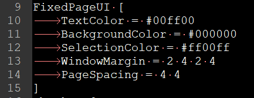
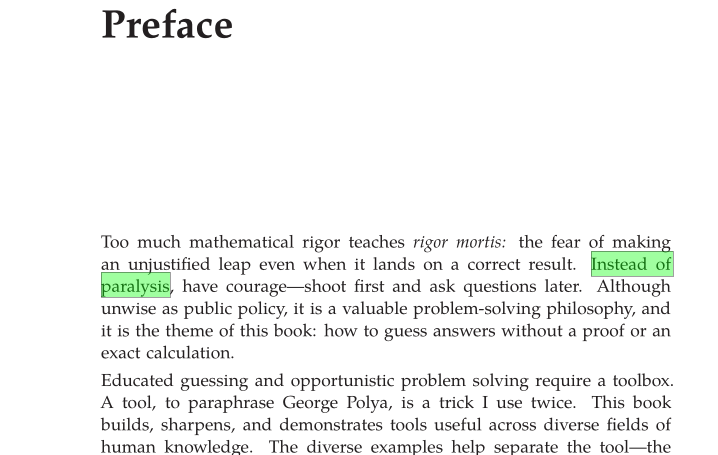
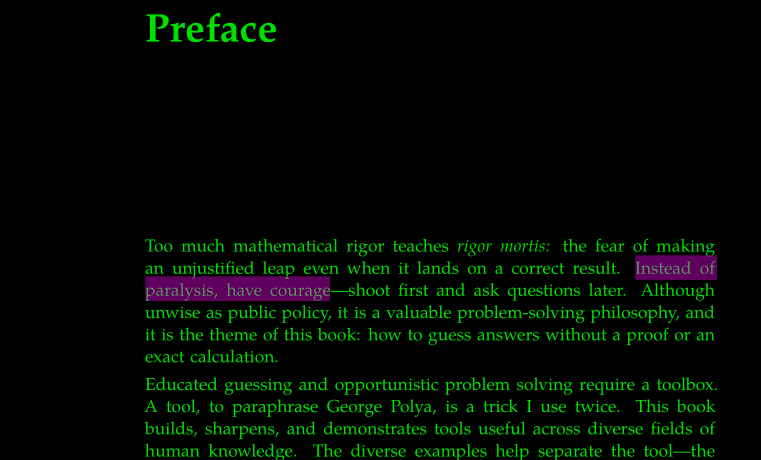
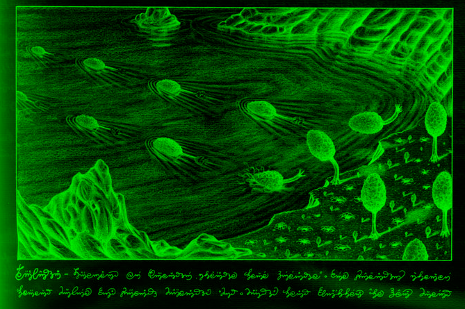

# Dark Mode (Modo Oscuro) en el pc para libros

El dark mode para leer libros es habitual en Android (por ejemplo con ebook reader). En pc se puede hacer con adobe acrobat (uck!), y con Microsoft Edge si tienes el tema de alto contraste de windows.

Sin embargo mi forma preferida es usar Sumatra pdf reader. Este lector pesa muy poco y es simple.

## 1. Instalar Sumatra PDF

Ehh si, instalalo... [este](https://www.sumatrapdfreader.org/free-pdf-reader) es el link.

## 2. Ubica el archivo SumatraPDF-settings.txt

En mi caso estaba en ```"C:\Users\user\AppData\Roaming\SumatraPDF\SumatraPDF-settings.txt"```



## 3. Editar el archivo

Las 3 variables de interes son:
```
    TextColor = #000000
    BackgroundColor = #ffffff
    SelectionColor = #00ff00
```


El fondo será BackgroundColor. Poner un color oscuro.
El texto será TextColor. Poner un color que resalte con el fondo, por ejemplo verde claro.
La seleccion será SelectionColor. Poner tambien un color que resalte con el fondo pero distinto.

El número que hay que colocar es un código RGB. Un selector de color útil para esto es [este](https://www.rapidtables.com/web/color/RGB_Color.html).

Yo usaré en este ejemplo:

```
BackgroundColor Negro --> #000000
TextColor Verde --> #00FF00
SelectionColor Magenta --> #FF00FF
```


### Antes



De Street-Fighting Mathematics - The Art of Educated Guessing and Opportunistic Problem Solving.pdf


De Luigi Serafini - Codex Seraphinianus-Abbeville Press (1983).djvu

### Despues


Esto tambien afecta imágenes:

